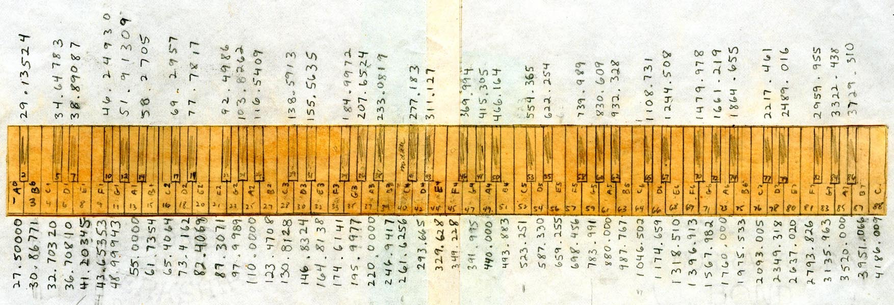
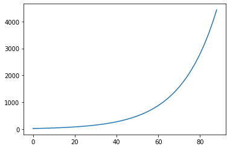
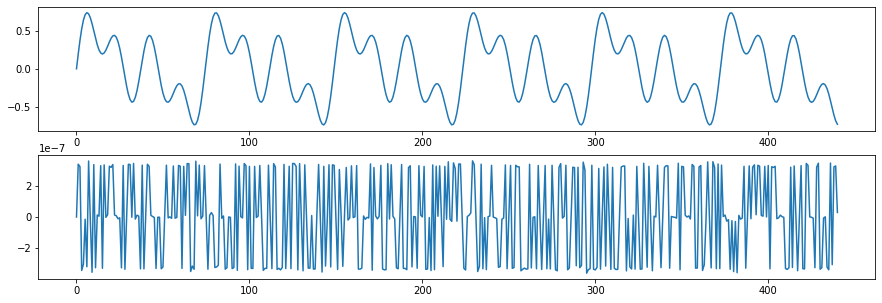
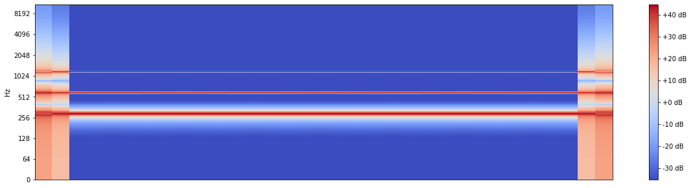
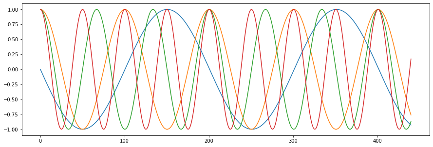
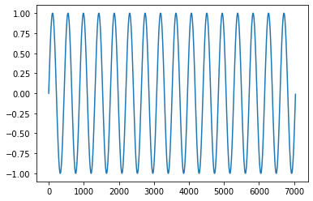
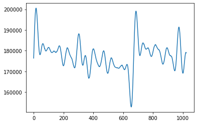

# [#0] Co w trawie piszczy -- czyli o dźwięku słów kilka ... 
---
### Witaj Drogi Czytelniku!   

Trafiłeś tutaj zapewnie dlatego, że jesteś nieprzeciętnie zainteresowany podróżą międzygwiezdną, w której łączyć się będzie muzyka (poważna, albo i nie), analiza danych, matematyka, **danologia** (nie jest to nauka o serkach homogenizowanych, tylko poważna sprawa. Tak, tak wiem ... , to spolszeczenie poważnego `Data Science` brzmi przezabawnie, no ale wobec tego - czemu pozbawiać się tej szczypty humoru?) i wiele innych planet w naukowym uniwersum, które zdażyło mi się odwiedzić. (No dobra, niektóre z nich widziałem tylko przez [lunetę Galileusza](https://pl.wikipedia.org/wiki/Luneta_Galileusza)). Jeśli natomiast Twoja przestrzeń zainteresowań nie ma kompletnie nic wspólnego z tym, o czym przed chwilą wspomniałem, to tym bardziej cieszę się, że tu trafiłeś. I zapraszam do tej przygody. Ponadto, jak pewnie nie trudno zauważyć (przyznaj, że przeskrolowałeś artykuł, zanim dotarłeś do tego zdania?!), oprócz nieskładnej polszczyzny, będę posługiwał się w trakcie tej podróży językiem `python`. Co prawda, nie ukończyłem żadnego kursu kodowania w tym języku, ale matura z polskiego też nie poszła mi najlepiej, więc czym tu się przejmować. Większe dramaty ludzi w życiu spotykają. (A'propos kursu kodowania - moja Małżonka stwierdziła, że to taki kurs dla listonoszy, gdzie w trakcie egzaminu liczy się tylko to, kto pierwszy wykrzyczy egzaminatorowi, że z kopertą sygnowaną kodem 26-612 pospiesznie jedzie do Radomia). 

Dobrze, wejdźmy zatem w tę opowieść, której preludium będzie dotykało rzeczy podstawowej i jednocześnie pozwoli nam pójść dalej w poważne rozważania - **Czym jest dźwięk?**  - No nie powiesz mi, że nigdy nie zastanawiało Cię, jak to się dzieje, że Spotify wysyła do Ciebie Twój ulubiony hit disco-polo, i on gna najpierw przez łącza internetowe (uwaga, za niedługo pewnie poleci przez nadajniki 5G), potem po układach scalonych Twojego smartfona trafia do złącza słuchawkowego (albo nadajnika Bluetooth :B ) i następnie po miedzianych drutach w kablu (albo wspomnianym *Niebieskim Kłem*) na membranę słuchawek i stamtąd wprost do Twojego ucha...? Nie, nie myślałeś nigdy o tym? W takim razie muszę na poważnie wziąć sobie do serca słowa moich najbliżych, że się o mnie martwią i że ja *...to zawsze byłem taki jakiś dziwny...* . Tak czy inaczej, chciałem zabrać się za budowę poważnego modelu `Machine Learning` wynoszącego mnie na wyżyny tajników tej sztuki magicznej, po czym uświadomiłem sobie, że w sumie to nie do końca wiem, co w moich danych siedzi. I czy ja w ogóle te dane mam? I od czego powinienem zacząć? Zszedłem więc z mentalnego Everestu dumy i samouwielbienia, zrobiłem sobie kawę i siedząc w gondoli na Gubałówkę (znów jedynie w myślach, jest przecież narodowa kwarantanna, to siedzę w domu i piszę!)  zacząłem od początku... od zrozumienia tego, jak okiełznać dźwięk w analizie danych! 

--- 
### Biblioteki, z których będę korzystał w tym materiale to: 
> `numpy` - podstawowa reprezentacja danych w postaci wektora wartości i kilka innych zastosowań - matematyka w pythonie   
> `librosa` oraz `librosa.display` - potężne narzędzie do analizy i wizualizacji sygnałów dźwiękowych - bez tego ani rusz! 
> `matplotlib.pyplot` - podstawowa forma prezentacji danych w postaci wykresów, na ten moment wystarczająca


```python
import numpy as np

import librosa 
import librosa.display

import matplotlib.pyplot as plt
%matplotlib inline
```

---
## Subiektywne wprowadzenie do cyfrowego przetwarzania sygnałów

> **1. Dźwięk - charakterystyka fizyczna**  
> **2. Częstotliwość dźwięku**   
> **3. Cyfrowa reprezentacja dźwięku**

> 4. Dziedziny przetwarzania sygnału   
> 5. Transformata Fouriera   
---

### 1. Dźwięk - jak to jest, że słyszymy? 

Z filiżanką espresso stawiam sobie to nurtujące pytanie - jak to się dzieje, że na każdym kroku słyszę? Zarówno miłe dźwięki [kwartetu smyczkowego i mandoliny](https://youtu.be/InME0wn4Fnw), jak i kłótnię klientów warzywniaka o ostatnie, niezgniłe truskawki z koszyczka (zostawiam Tobie Czytelniku, znalezienie egzemplarycznego nagrania na YouTubie!). I pomijam w tym miejscu wszystkie kwestie naturalnego odbiornika dźwięku w postaci ucha (w moim przypadku nawet dwóch sztuk) i ilości odbytych wizyt u laryngologa. No i jeszcze nierozwikłany temat tego, że komunikat z poleceniem zawieszenia moskitiery w oknie balkonowym wysłany przez moją Małżonkę, co prawda dotarł do ucha dość sprawnie, ale czas przetwarzania wyniósł w okolicy 12 miesięcy. Nie wiem, nie znam się, zarobiony jestem!   
Natomiast zagadka, którą chciałbym rozwikłać to fizyczna interpretacja zjawiska dźwięku. Czyli, co dzieje się pomiędzy nadajnikiem, a odbiornikiem dźwięku, patrząc okiem (i uchem) akustyka-teoretyka. 

> **Dźwięk** - okresowe zaburzenia gęstości i ciśnienia cząstek ośrodka w postaci fal podłużnych przemieszczających się od źródła dźwięku (energii wywołującej falę akustyczną).

Rozumiem, że powyższa formułka może przywołać wszelkie traumy z dzieciństwa i życia studenckiego, kiedy to każdy z nas uczył się po nocach nic nie znaczących zlepków słów, zwanych przez nauczycieli/wykładowców `definicjami`. Już biegnę na ratunek, o co w tym wszystkim chodzi.

Zacznijmy od `ośrodka`, w którym roznosi się dźwięk. W większości codziennych sytuacji mamy do czynienia z powietrzem, którym oddychamy. No chyba, że jesteś delfinem i umawiasz się z kumplami na piwo w zatoce - wtedy Twóje nawoływanie na weekendową schadzkę rozchodzi w bezkresach morskiej toni (Słona woda i piwo, dla mnie słabo, ale jak delfiny lubią, to kto im zabroni). `Źródłem dźwięku` może być wspomniany delfin albo wiertarka sąsiada, który akurat wpadł na pomysł, żeby remontować mieszkanie w zwykły, poniedziałkowy poranek. Albo też ja, który chcąc dobrnąć choć do połowy czasu w mojej zdalnej pracy, rzucam obfitą wiązanką z osobistego wokabularza (Dział: "Nie używać za często przy dzieciach i wigilijnym stole!") w kierunku wyżej wspomnianego jegomościa. No dobra, to zmierzmy się teraz z `zaburzeniami gęstości i ciśnienia` - brzmi strasznie.   

Zdarza się czasem, że sąsiad akurat nic nie remontuje i wtedy jest szansa na chwilę niezmąconej niczym ciszy, a ciśnienie powietrza kojarzy się jedynie z Krzysztofem Zubilewiczem i jego prognozą pogody z terenowego studia. To ciśnienie, prezentowane przez przemiłego Pana Krzysztofa, to dla rozchodzenia się dźwięku pewne *status quo, tabula rasa, indeks pierwszaka przed zimową sesją*. Nie dzieje się nic. Pusto, głucho, cicho. I aby dźwięk mógł zaistnieć, trzeba ten stoicki stan zaburzyć, to znaczy zagęszczać i rozrzedzać cząsteczki ośrodka, w którym się rozchodzi. I gdy mówię o zagęszczaniu atmosfery, bynajmniej nie mam na myśli poruszania drażliwych tematów przy świątecznym stole, choć w wielu wypadkach wiąże się to z wydawaniem z siebie, niekoniecznie przemyślanych i składnych w swej treści, dźwięków. 

Idzie o to, że gdy już nieopatrznie wypowiemy pierwsze słowo rodzącej się rodzinnej batalii, powietrze wydobywające się z naszych płuc (otrzymując energię kinetyczną od mięśni przepony i klatki piersiowej), przechodzi przez struny głosowe jak sznur aut na bramkach w Balicach w drodze do Zakopanego. Części uda się niepostrzeżenie przemknąć, bo są nowocześni i na bramkach płacą z aplikacją (jak w Lidlu, albo w Auchan, albo ... teraz to już prawie wszędzie...). Ale zawsze znajdzie się ktoś, kto akurat chce zapłacić skrzętnie zbieranymi od pół roku miedziakami w słoiku... i co Pan zrobisz?! Nic nie zrobisz! No to tak właśnie te cząsteczki powietrza przelatują przez struny głosowe, raz gęściej, raz rzadziej, raz gęściej, raz rzadziej ... i bum! - mamy dźwięk! Jeszcze tylko nagłośnienie w postaci rezonatorów w naszej głowie i ekspertyza meteorologiczno-epidemiczno-polityczna może lądować w uszach wyczekujących jej słuchaczy. 

> **Dźwięk** - (druga definicja, jakby pierwsza była niestrawna) - szereg zmian (odchyleń) ciśnienia ośrodka od stanu podstawowego (bazowego), wywołany wprowadzoną do układu porcją energii.

Żywię nadzieję, że druga definicja jest łagodniejsza dla Twojego żołądka i innych organów wewnętrznych, a jeśli nie, to weźmy na tapet podstawowe pojęcia opisujące dźwięk: pojęcie **częstotliwości** i **amplitudy** dźwięku (czy fali w ogólności). Dorzucę do tego kilka obrazków, wykresów, doprawię soczystym komentarzem i być może damy radę wspólnie wypić ten naważony, intelektualny browar. 

### Częstotliwość dźwięku -- co to jest? 

Muzyka poważna wbrew pozorom nie jest tak poważna za jaką uchodzi, potrafi płatać figle i wpuszczać niewprawnego słuchacza w przysłowiowe maliny. Weźmy taki oto wyimaginowany przykład, którego jednak prawdopodobieństwo w realnym świecie oceniam na niezerowe. *Wydaje mi się, że może tak być* (i po tych słowach moja kariera analityka danych wydała ostatnie tchnienie, no ale...). Niewprawiony w tajniki muzyki poważnej słuchacz Adrian postanowił wybrać się do filharmonii na koncert. Z tym niewprawiony to nie przesadzam, bo do tej pory uważał, że szczytem estetyki w tym obszarze sztuki są aranżacje Piotra Rubika i klaskanie na głosy. Niemniej wybrał się raz, potem drugi, i trzeci ... i w jego analitycznej głowie zakiełkowała niedająca spokojnie spać wątpliwość. *Bo jak to jest,* - pomyślał - *że zarówno Bach, jak i Wagner, i nawet ksiądz Vivaldi do swoich utworów napisali identyczne, kilkutaktowe preludia?* Jeśli nie wiesz, drogi Czytelniku o jaki fragment muzyczny mi chodzi, zajrzyj do [19:47](https://youtu.be/2xlKfVF-FI0?t=1187) minuty podlinkowanego materiału. I proszę o jedno ... wróć tu z powrotem z odmętów YouTube. No i z tak wyszukanego żartu świata muzyki klasycznej naszego nieświadomego Adriana musiał wyprowadzić znawca tej sztuki, tłumacząc, że to nie autorskie dzieło Bacha, Mozarta czy Beethovena, tylko muzycy stroją swoje instrumenty, szukając **dźwięku A**. Teraz zadanie dla Ciebie - bądź profesjonalnym muzykiem - na poniższej grafice znajdź **dźwięk A**. (Podpowiem tylko, że jest ich nawet osiem).

[](http://shakahara.com/piano/keyboard.html)

Rozumiem, że zadanie wymaga wprawnego oka i odrobiny cierpliwości, ale potrzebuję Twojej chwili skupienia, żeby pójść dalej. Jak pewnie nie trudno zauważyć, wokół ryciny z klawiaturą fortepianu znajdują się nieśmiało zapisane cyfry. Teraz trzymaj się fotela, czy gumowej piłki (w zależności od tego na czym siedzisz), bo lecimy w ciężką matematykę. 

Złotym Gralem, Arką Przymierza, czy innym zaginionym skarbem każdego muzyka (*wszystkich muzyków przepraszam za to rażące uogolnienie, ale na potrzeby dalszej części wywodu jest ono niezbędne*) przed rozpoczęciem występu jest właśnie **dźwięk A**, a dokładnie ten sygnowany na powyższej rycinie numerem 49 o szlachetnej nazwie **A4**. I perfidnym zbiegem okoliczności trzeba nazwać fakt, że poszukiwanie w trakcie występu stron w formacie A4 z partyturą należy również do przerażąjących przygód, jakie mogą spotkać niejednego scenicznego artystę. Ale teraz nie o tym... rozszyfrujmy natomiast pojawiające się w tym pradawnym manuskrypcie zapisy. 

Wartość, którą można odczytać przy odmienionym przez (prawie) wszystkie przypadki dźwięku, jest magiczna liczba **440.000**. Przypomnę drobny szczegół, że zera po przecinku, ciągnące się w nieskończoność (jak trauma po nudnych lekcjach matematyki w podstawówce), są w tym wypadku nieistotne, więc możemy je pominąć. A dokładając do liczby **440** jednostkę zwaną **Hercem** otrzymujemy `częstotliwość` szukanego dźwięku. Czym wobec tego jest częstotliwość? 

> **Częstotliwość** - to ilość cykli (powtórzeń, uderzeń, zdarzeń ...) danego zjawiska w czasie jednej sekundy, tzn.
> $Hz = \frac{1}{1 \cdot s}$

Czyli jeśli chodzisz regularnie na siłownię, to znaczy pojawiasz się tam w każdym półroczu raz, to nie trudno policzyć, że częstotliwość tego rodzaju aktywności fizycznej w Twoim życiu wynosi **1.0563 nHz**. I już jest co wpisać w CV *Znam podstawy fizyki kwantowej i regularnie uprawiam sport, bywam na siłowni z częstotliwością ...*". Jako pracodawca, brałbym w ciemno...


```python
print('Częstotliwość chodzenia na siłownię: {:.4f} nHz'.format(1e9/((365.25/2)*24*60*60*60)))
```

    Częstotliwość chodzenia na siłownię: 1.0563 nHz
    


```python
plt.plot(27.5*2**(np.linspace(0,88,89)/12));
```





```python
semitones = 5
```


```python
440 * (2**(semitones/12))
```


    587.3295358348151


```python
librosa.note_to_hz("C5")
```


    523.2511306011972


```python
def create_simple_wave(hz=440, sample_rate=44100):
    
    xvalues = np.linspace(0, 2*np.pi*hz, int(sample_rate/2))

    return np.round(np.sin(xvalues),6)
```


```python
simple_wave = create_simple_wave(880, 2**15) + create_simple_wave(440, 2**15) + create_simple_wave(220, 2**15)
simple_wave = simple_wave/3

###Transformata Fouriera
magnitude = np.abs(librosa.stft(simple_wave))
angle = np.angle(librosa.stft(simple_wave))

### i z powrotem
new_wave = np.round(librosa.istft(magnitude*np.exp(1j*angle)),6)
```


```python
(simple_wave).min()
```


    -0.7441843333333334


```python
plt.figure(figsize=(15, 5))
plt.subplot(2,1,1)
plt.plot(simple_wave[:441]);

plt.subplot(2,1,2)
plt.plot(simple_wave[:441] - new_wave[:441]);

plt.figure(figsize=(20, 5))
C = librosa.amplitude_to_db(magnitude)
librosa.display.specshow(C, y_axis='log')
plt.colorbar(format='%+2.0f dB');
```








```python
amplitude.shape
```


    ---------------------------------------------------------------------------

    NameError                                 Traceback (most recent call last)

    <ipython-input-8-b01a6f95c358> in <module>
    ----> 1 amplitude.shape
    

    NameError: name 'amplitude' is not defined


```python
librosa.db_to_amplitude(C)
```


    array([[5.0420832e-02, 5.0420832e-02, 5.0420832e-02, ..., 5.0420832e-02,
            2.5064453e+01, 5.5700615e+01],
           [5.0420832e-02, 5.0420832e-02, 5.0420832e-02, ..., 5.0420832e-02,
            2.5114258e+01, 5.5794186e+01],
           [5.0420832e-02, 5.0420832e-02, 5.0420832e-02, ..., 5.0420832e-02,
            2.5248379e+01, 5.6055271e+01],
           ...,
           [5.0420832e-02, 5.0420832e-02, 5.0420832e-02, ..., 5.0420832e-02,
            9.8914154e-02, 2.1950784e-01],
           [5.0420832e-02, 5.0420832e-02, 5.0420832e-02, ..., 5.0420832e-02,
            9.8913506e-02, 2.1950625e-01],
           [5.0420832e-02, 5.0420832e-02, 5.0420832e-02, ..., 5.0420832e-02,
            9.8913290e-02, 2.1950573e-01]], dtype=float32)


```python
plt.figure(figsize=(15, 5))
base_hz = 440
plt.plot(create_simple_wave(base_hz, 44100, np.pi/2)[:441]);
plt.plot(create_simple_wave(base_hz*2, 44100)[:441]);
plt.plot(create_simple_wave(base_hz*3, 44100)[:441]);
plt.plot(create_simple_wave(base_hz*4, 44100)[:441]);
```





```python
xvalues
```


    array([0.00000000e+00, 1.42802904e-02, 2.85605808e-02, ...,
           6.29717967e+02, 6.29732247e+02, 6.29746527e+02])


```python
plt.plot(np.sin(xvalues[:440*16]));
```





```python

```


```python
xvalues
```


    array([0.        , 0.06268938, 0.12537875, 0.18806813, 0.25075751,
           0.31344689, 0.37613626, 0.43882564, 0.50151502, 0.56420439,
           0.62689377, 0.68958315, 0.75227253, 0.8149619 , 0.87765128,
           0.94034066, 1.00303004, 1.06571941, 1.12840879, 1.19109817,
           1.25378754, 1.31647692, 1.3791663 , 1.44185568, 1.50454505,
           1.56723443, 1.62992381, 1.69261318, 1.75530256, 1.81799194,
           1.88068132, 1.94337069, 2.00606007, 2.06874945, 2.13143883,
           2.1941282 , 2.25681758, 2.31950696, 2.38219633, 2.44488571,
           2.50757509, 2.57026447, 2.63295384, 2.69564322, 2.7583326 ,
           2.82102197, 2.88371135, 2.94640073, 3.00909011, 3.07177948,
           3.13446886, 3.19715824, 3.25984762, 3.32253699, 3.38522637,
           3.44791575, 3.51060512, 3.5732945 , 3.63598388, 3.69867326,
           3.76136263, 3.82405201, 3.88674139, 3.94943076, 4.01212014,
           4.07480952, 4.1374989 , 4.20018827, 4.26287765, 4.32556703,
           4.38825641, 4.45094578, 4.51363516, 4.57632454, 4.63901391,
           4.70170329, 4.76439267, 4.82708205, 4.88977142, 4.9524608 ,
           5.01515018, 5.07783955, 5.14052893, 5.20321831, 5.26590769,
           5.32859706, 5.39128644, 5.45397582, 5.51666519, 5.57935457,
           5.64204395, 5.70473333, 5.7674227 , 5.83011208, 5.89280146,
           5.95549084, 6.01818021, 6.08086959, 6.14355897, 6.20624834])


```python
def create_tone_from_note(note_name, note_time):
    sample_rate = 44100
    hz = librosa.note_to_hz(note_name)
    
    length = sample_rate / float(hz)
    omega = np.pi * 2 / length
    xvalues = np.arange(int(length)) * omega
    onecycle = 4096 * np.sin(xvalues)
    samples = 1.0*np.resize(onecycle, (sample_rate*note_time,)).astype(np.int16)
    return samples
```


```python
len(np.linspace(0,0,44100*4))
```


    176400


```python
abs(np.random.uniform(0,1))
```


    0.6518906863953566


```python
def create_tone_from_note(note_name, note_time):
    sample_rate = 44100
    hz_base = librosa.note_to_hz(note_name)
    samples = len(np.linspace(0,0,sample_rate*note_time))
    for i in range(1,17):
        hz = hz_base*i
        length = sample_rate / float(hz)
        omega = np.pi * 2 / length
        xvalues = np.arange(int(length)) * omega
        onecycle = 4096*abs(np.random.uniform(0,1)) * np.sin(xvalues)
        samples = samples + 1.0*np.resize(onecycle, (sample_rate*note_time,)).astype(np.int16)
        
    return samples
```


```python
C = create_tone_from_note("C2",4)
```


```python
plt.plot(C[:1024]);
```





```python
C = create_tone_from_note("C5",4)
F = create_tone_from_note("F5",4)
G = create_tone_from_note("G5",4)
```


```python
def play_note(note_name,time=1):
    samples = create_tone_from_note(note_name, time)

    p = pyaudio.PyAudio()

    # for paFloat32 sample values must be in range [-1.0, 1.0]
    stream = p.open(format=pyaudio.paFloat32,
                    rate=sample_rate,
                    channels=1,
                    output=True)

    # play. May repeat with different volume values (if done interactively) 
    stream.write(samples)

    stream.stop_stream()
    stream.close()

    p.terminate()
```


```python
for note, time in [('C5',8),('E5',8),('G5',4),
                   ('G5',8),('A5',8),('G5',8),('F5',8),('E5',8),('E5',8),('D5',8),('D5',8),('E5',4),('D5',8),
                   ('C5',8),('E5',8),('G5',4),
                   ('G5',8),('A5',8),('G5',8),('F5',8),('E5',8),('E5',8),('D5',8),('D5',4),
                   ('C5',8),('E5',8),('G5',4),
                   ('G5',8),('A5',8),('G5',8),('F5',8),('E5',8),('E5',8),('D5',8),('D5',8),('E5',4),('D5',8),
                   ('C5',8),('E5',8),('G5',4),
                   ('G5',8),('A5',8),('G5',8),('F5',8),('E5',8),('D5',8),('G5',8),('C5',4)]:
    play_note(note, int(16/time))
```


```python
play_note("G5",4)
play_note("E5",4)
play_note("G5",4)
play_note("E5",4)
play_note("G5",4)
play_note("A5",2)
play_note("G5",2)
play_note("F5",2)
play_note("E5",2)
play_note("F5",4)
```


    ---------------------------------------------------------------------------

    KeyboardInterrupt                         Traceback (most recent call last)

    <ipython-input-261-9ea5132b119d> in <module>
          2 play_note("E5",2)
          3 play_note("G5",4)
    ----> 4 play_note("E5",4)
          5 play_note("G5",4)
          6 play_note("A5",2)
    

    <ipython-input-260-a156c3466434> in play_note(note_name, time)
         11 
         12     # play. May repeat with different volume values (if done interactively)
    ---> 13     stream.write(samples)
         14 
         15     stream.stop_stream()
    

    ~\AppData\Local\Continuum\anaconda3\lib\site-packages\pyaudio.py in write(self, frames, num_frames, exception_on_underflow)
        584 
        585         pa.write_stream(self._stream, frames, num_frames,
    --> 586                         exception_on_underflow)
        587 
        588 
    

    KeyboardInterrupt: 


```python
sample_rate = 44100

def sine_wave(hz, peak, n_samples=sample_rate):
    """Compute N samples of a sine wave with given frequency and peak amplitude.
       Defaults to one second.
    """
    length = sample_rate / float(hz)
    omega = np.pi * 2 / length
    xvalues = np.arange(int(length)) * omega
    onecycle = peak * np.sin(xvalues)
    return np.resize(onecycle, (n_samples,)).astype(np.int16)

def square_wave(hz, peak, duty_cycle=.5, n_samples=sample_rate):
    """Compute N samples of a sine wave with given frequency and peak amplitude.
       Defaults to one second.
    """
    t = np.linspace(0, 1, 500 * 440/hz, endpoint=False)
    wave = scipy.signal.square(2 * np.pi * 5 * t, duty=duty_cycle)
    wave = np.resize(wave, (n_samples,))
    return (peak / 2 * wave.astype(np.int16))

# Play A (440Hz) for 1 second as a sine wave:
play_for(sine_wave(440, 4096), 1000)

# Play A-440 for 1 second as a square wave:
play_for(square_wave(440, 4096), 1000)
```


    ---------------------------------------------------------------------------

    error                                     Traceback (most recent call last)

    <ipython-input-57-f8885bbbd18a> in <module>
         21 
         22 # Play A (440Hz) for 1 second as a sine wave:
    ---> 23 play_for(sine_wave(440, 4096), 1000)
         24 
         25 # Play A-440 for 1 second as a square wave:
    

    <ipython-input-11-d74fecb69499> in play_for(sample_wave, ms)
          1 def play_for(sample_wave, ms):
          2     """Play the given NumPy array, as a sound, for ms milliseconds."""
    ----> 3     sound = pygame.sndarray.make_sound(sample_wave)
          4     sound.play(-1)
          5     pygame.time.delay(ms)
    

    ~\AppData\Local\Continuum\anaconda3\lib\site-packages\pygame\sndarray.py in make_sound(array)
         78     audio format.
         79     """
    ---> 80     return numpysnd.make_sound (array)
         81 
         82 def use_arraytype (arraytype):
    

    ~\AppData\Local\Continuum\anaconda3\lib\site-packages\pygame\_numpysndarray.py in make_sound(array)
         73     """
         74 
    ---> 75     return mixer.Sound (array=array)
         76 
    

    error: mixer not initialized


```python

```
